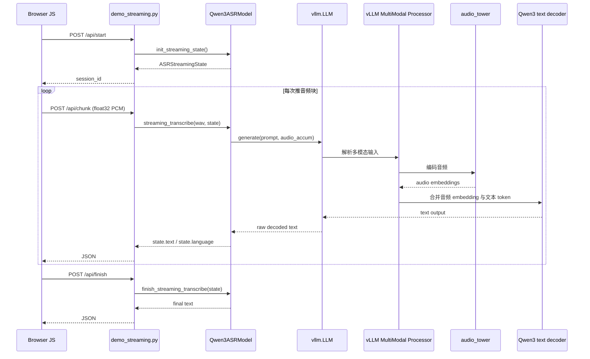

# Qwen3-ASR 源码调用链学习指南

配套文档：

- [QWEN3_ASR_STREAMING_TECH_REPORT_CN.md](./QWEN3_ASR_STREAMING_TECH_REPORT_CN.md)

这份文档的定位不是“再讲一遍结论”，而是：

> 带着你顺着源码真正走一遍调用链，知道每一层在做什么、输入输出是什么、为什么这样设计、你该从哪里下断点开始学。

---

## 1. 你现在最该建立的心智模型

如果把整个仓库压成一条线，可以先记成下面这样：

```text
浏览器 / 调用方
  -> demo / API 层
  -> Qwen3ASRModel 高层封装
  -> backend 分发
  -> processor / multimodal planner
  -> audio tower
  -> text decoder
  -> parse_asr_output
  -> 页面或调用方拿到结果
```

但是这条线里有两个非常容易混淆的分叉：

1. `transformers backend`
2. `vLLM backend`

而 **streaming 只走 vLLM backend**。

所以这份文档的重点，是带你吃透：

> `浏览器 -> Flask -> Qwen3ASRModel.LLM -> vLLM multimodal processor -> audio_tower -> language_model -> 字幕`

---

## 2. 先认全主要入口文件

## 2.1 对外公开入口

- [qwen_asr/__init__.py](./qwen_asr/__init__.py)

这里的作用很简单：

- 把 `Qwen3ASRModel` 暴露给用户
- 让你可以直接写 `from qwen_asr import Qwen3ASRModel`

所以外部用户看到的是包级 API，内部真实逻辑都在 `inference`、`core`、`cli` 里。

## 2.2 高层推理封装

- [qwen_asr/inference/qwen3_asr.py](./qwen_asr/inference/qwen3_asr.py)

这是你读这个项目时最应该先抓住的文件。  
它负责：

- 统一 transformers / vLLM 两种 backend
- 提供 `transcribe()`
- 提供 `init_streaming_state()`
- 提供 `streaming_transcribe()`
- 提供 `finish_streaming_transcribe()`

## 2.3 网页 streaming demo

- [qwen_asr/cli/demo_streaming.py](./qwen_asr/cli/demo_streaming.py)

这个文件把浏览器麦克风、HTTP 接口和 `Qwen3ASRModel` 绑起来。

## 2.4 processor

- [qwen_asr/core/transformers_backend/processing_qwen3_asr.py](./qwen_asr/core/transformers_backend/processing_qwen3_asr.py)

它的关键任务是：

- 提取音频特征
- 计算音频 encoder 输出长度
- 把一个逻辑上的音频占位 token 扩成“和音频特征长度一样多的 placeholder token”

## 2.5 transformers 版模型结构

- [qwen_asr/core/transformers_backend/modeling_qwen3_asr.py](./qwen_asr/core/transformers_backend/modeling_qwen3_asr.py)

这是理解“音频怎么进 decoder”的关键。

## 2.6 vLLM 版多模态模型接入

- [qwen_asr/core/vllm_backend/qwen3_asr.py](./qwen_asr/core/vllm_backend/qwen3_asr.py)

这是理解“为什么 vLLM 路径没显式调用 `processor.__call__()` 但仍然能跑”的关键。

---

## 3. 先画一张总调用链图

## 3.1 streaming demo 的总链路



如果你只记一件事，就记这个：

> 浏览器并不是直接喂模型；浏览器只是在不停调用 HTTP 接口。真正懂 ASR 的，是 `Qwen3ASRModel` 和 backend 下面那几层。

---

## 4. 第一层：浏览器和 Flask demo 是怎么接上的

文件：

- [qwen_asr/cli/demo_streaming.py](./qwen_asr/cli/demo_streaming.py)

你读这个文件时，可以按下面顺序看。

## 4.1 浏览器端 JS 做了什么

浏览器端核心动作有 4 个：

1. 申请麦克风权限
2. 采集音频
3. 重采样到 `16kHz`
4. 把 float32 PCM 发到后端

你会看到这些函数：

- `apiStart()`
- `apiPushChunk()`
- `apiFinish()`
- `pump()`
- `btnStart.onclick`
- `btnStop.onclick`

### 4.1.1 `apiStart()`

它向 `/api/start` 发送一个 POST，请后端创建一个新的 streaming 会话。

### 4.1.2 `apiPushChunk()`

它向 `/api/chunk` 发送二进制音频块，`Content-Type` 是 `application/octet-stream`。

### 4.1.3 `apiFinish()`

它告诉后端：

- 不再推新音频了
- 把最后还没解码的尾巴 flush 掉

### 4.1.4 `pump()`

这是真正的“循环推块”函数。

它的逻辑可以缩成：

```text
只要页面还在录音，且本地缓冲里至少有一个 chunk，就把这个 chunk 发给后端
```

## 4.2 Flask 端做了什么

这个文件同时也是一个最小 Flask server。

你重点看 3 个接口：

- `/api/start`
- `/api/chunk`
- `/api/finish`

### 4.2.1 `/api/start`

作用：

- 调 `asr.init_streaming_state()`
- 生成 `session_id`
- 把 `session_id -> state` 存到内存字典里

也就是说，这个 demo 的 session 管理非常朴素：

> 一个浏览器会话，对应服务端内存里的一个 `ASRStreamingState`。

### 4.2.2 `/api/chunk`

作用：

1. 找到 `session_id` 对应的 state
2. 把 request body 解释成 `float32` 数组
3. 调 `asr.streaming_transcribe(wav, state)`
4. 返回当前的 `language` 和 `text`

### 4.2.3 `/api/finish`

作用：

1. 调 `asr.finish_streaming_transcribe(state)`
2. 返回最终文本
3. 删除这个 session

所以这一层本质上只是：

> 把浏览器音频块转成 Python 数组，然后转手交给 `Qwen3ASRModel`。

---

## 5. 第二层：`Qwen3ASRModel` 是怎样统一两种 backend 的

文件：

- [qwen_asr/inference/qwen3_asr.py](./qwen_asr/inference/qwen3_asr.py)

## 5.1 为什么这个类是全局总入口

因为它对外提供了统一 API：

- `from_pretrained(...)` 对应 transformers backend
- `LLM(...)` 对应 vLLM backend
- `transcribe(...)`
- `init_streaming_state(...)`
- `streaming_transcribe(...)`
- `finish_streaming_transcribe(...)`

也就是说：

> 你平时以为自己在“调模型”，其实先是在调用一个高层调度器。

## 5.2 `from_pretrained()` 和 `LLM()` 的区别

### 5.2.1 `from_pretrained()`

它会：

1. `AutoModel.from_pretrained(...)`
2. `AutoProcessor.from_pretrained(...)`
3. 返回 `backend="transformers"` 的 `Qwen3ASRModel`

### 5.2.2 `LLM()`

它会：

1. 导入 `vllm.LLM`
2. 构造 `vllm.LLM(model=...)`
3. 构造 `Qwen3ASRProcessor`
4. 构造 `SamplingParams`
5. 返回 `backend="vllm"` 的 `Qwen3ASRModel`

所以 streaming 只支持 vLLM，不是一个偶然说明，而是从入口设计就已经分叉了。

---

## 6. 第三层：streaming 状态机到底怎么工作

还是文件：

- [qwen_asr/inference/qwen3_asr.py](./qwen_asr/inference/qwen3_asr.py)

## 6.1 先看 `ASRStreamingState`

这是你学会 streaming 的第一关键对象。

它里面最重要的字段是：

- `buffer`
- `audio_accum`
- `prompt_raw`
- `text`
- `_raw_decoded`
- `chunk_id`
- `unfixed_chunk_num`
- `unfixed_token_num`

### 6.1.1 `buffer`

刚收到、但还没攒够一个 decode chunk 的 PCM。

### 6.1.2 `audio_accum`

从开头到当前时刻为止、已经纳入 streaming 上下文的全部音频。

### 6.1.3 `prompt_raw`

聊天模板生成出来的基础 prompt，不含后续回填的 prefix 文本。

### 6.1.4 `_raw_decoded`

上一轮生成出来的“原始完整字符串”，后面做 token rollback 要靠它。

### 6.1.5 `text`

解析后的可展示文本。

## 6.2 `init_streaming_state()`

它做的事情很少，但很重要：

1. 检查 backend 必须是 `vllm`
2. 校验 `chunk_size_sec`
3. 可选地固定语言
4. 把 `prompt_raw` 预先构造好
5. 初始化一个空 state

这一步的意义是：

> 把“不会随着每个 chunk 改变的东西”先固定下来。

## 6.3 `streaming_transcribe()`

这是 streaming 的核心函数。

建议你按下面顺序读。

### 6.3.1 第一步：规范化输入

它先把音频转成：

- 单通道
- 一维
- `float32`

### 6.3.2 第二步：放进 `buffer`

这一步还不解码，只是缓存。

### 6.3.3 第三步：判断是否攒够了一个 decode chunk

只有当：

```text
len(buffer) >= chunk_size_samples
```

才进入真正的推理分支。

### 6.3.4 第四步：把新 chunk 拼进 `audio_accum`

这一点要非常明确：

> 当前 streaming API 每次真正推理时，用的是“从开头到当前时刻的全部音频”，不是只用刚到的新 chunk。

### 6.3.5 第五步：构造 prefix

逻辑是：

- 早期 chunk：`prefix = ""`
- 后期 chunk：把 `_raw_decoded` 的最后 `K` 个 token 去掉，再把剩下的当 prefix

这是为了减轻文本边界抖动。

### 6.3.6 第六步：调用 `generate()`

真正送给模型的是：

```text
prompt = state.prompt_raw + prefix
audio  = state.audio_accum
```

这一行几乎就是整个 streaming 实现最重要的源码事实。

### 6.3.7 第七步：更新 state

模型输出回来以后：

- 更新 `_raw_decoded`
- 调 `parse_asr_output()`
- 更新 `state.language`
- 更新 `state.text`

## 6.4 `finish_streaming_transcribe()`

这一步和上面基本同构，只是它负责把不足一个 chunk 的尾巴也解出来。

所以停止录音时，最后文本再修一下，是完全正常的。

---

## 7. 第四层：processor 在 transformers 路径里是怎么工作的

文件：

- [qwen_asr/core/transformers_backend/processing_qwen3_asr.py](./qwen_asr/core/transformers_backend/processing_qwen3_asr.py)

这个文件是理解“音频为什么能塞进语言模型”的关键。

## 7.1 最重要的两个函数

- `_get_feat_extract_output_lengths()`
- `replace_multimodal_special_tokens()`

## 7.2 `_get_feat_extract_output_lengths()`

这个函数不是锦上添花，它是 shape 对齐的生命线。

它的意义是：

> 预测音频 encoder 最后会输出多少个音频 embedding。

因为只有算对了这个长度，才能知道文本 prompt 里需要预留多少个 audio placeholder token。

## 7.3 `replace_multimodal_special_tokens()`

这个函数会把一个逻辑音频 token 扩成多个重复的 placeholder。

直觉上就是：

```text
一个 <audio>
  -> 不是一个 token 位置
  -> 而是一整段“足够容纳音频 embedding 序列”的 token 位置
```

这一步做完以后，文本 token 序列长度才和多模态 embedding 数量对得上。

---

## 8. 第五层：transformers 版模型里，音频到底怎么进 decoder

文件：

- [qwen_asr/core/transformers_backend/modeling_qwen3_asr.py](./qwen_asr/core/transformers_backend/modeling_qwen3_asr.py)

## 8.1 你要抓住三个函数

- `get_audio_features()`
- `get_placeholder_mask()`
- `forward()`

## 8.2 `get_audio_features()`

它做的是：

1. 遍历每个音频样本
2. 只取有效特征长度
3. 调 `audio_tower(...)`
4. 得到连续音频 embedding

这里的 `audio_tower` 就是论文对应的音频 encoder。

## 8.3 `get_placeholder_mask()`

它找出文本序列里哪些位置是 audio placeholder。

## 8.4 `forward()`

这一步最重要的动作是：

```text
inputs_embeds = text token embedding
audio_features = audio_tower output
inputs_embeds.masked_scatter(audio_mask, audio_features)
```

也就是：

> 先有一串文本 embedding，再把其中代表音频的位置替换成真正的音频 embedding。

从这里开始，后面的 decoder 就把这整个序列当成普通输入来生成文本。

---

## 9. 第六层：为什么 vLLM 路径看起来没调 processor，但其实也做了同样的事

文件：

- [qwen_asr/core/vllm_backend/qwen3_asr.py](./qwen_asr/core/vllm_backend/qwen3_asr.py)

这是最容易读丢的一层。

## 9.1 先记住一句话

在 vLLM 路径里：

> 高层 Python 包装没有显式调用 `Qwen3ASRProcessor.__call__()`，但 vLLM 内部注册了一套多模态处理器，替你完成了等价工作。

## 9.2 哪几段代码最关键

### 9.2.1 `Qwen3ASRMultiModalProcessor`

它负责：

- 从 audio 里得到特征长度
- 生成 prompt replacement 规则

### 9.2.2 `PromptReplacement`

它告诉 vLLM：

- 当 prompt 中遇到 audio placeholder 时
- 要替换成多少个音频 token 位置

### 9.2.3 `embed_multimodal()`

它负责：

- 解析输入的 audio 特征
- 调 `audio_tower`
- 得到真正的 multimodal embeddings

### 9.2.4 `embed_input_ids()`

它先做普通文本 embedding，然后调用 `_merge_multimodal_embeddings(...)` 把音频 embedding 合进去。

你会发现：

- 这和 transformers 路径的 `masked_scatter` 在本质上是同一件事
- 只是实现放到了 vLLM 的多模态框架里

## 9.3 vLLM 路径的直觉版调用链

```text
Qwen3ASRModel._infer_asr_vllm()
  -> vllm.LLM.generate(prompt + multi_modal_data)
  -> Qwen3ASRMultiModalProcessor
  -> PromptReplacement
  -> embed_multimodal()
  -> audio_tower
  -> embed_input_ids()
  -> language_model
  -> text output
```

---

## 10. streaming 调用链里，最容易误解的三件事

## 10.1 误解一：浏览器每 500ms 传一次，就等于模型每 500ms 解一次

不是。

浏览器推送频率是 transport 层。  
模型何时真正 `generate()`，取决于 `chunk_size_sec`。

## 10.2 误解二：后端每次只解新 chunk

不是。

当前实现里，每次真正解码都会把 `audio_accum` 整段重新送给模型。

## 10.3 误解三：旧字幕被改掉，是前端写坏了

不是。

后端本身就故意回滚尾部 token，再根据更长上下文重生成。

---

## 11. 你如果要在 IDE 里跟断点，推荐这样下

如果你的目标是“真正学会”，我建议你不要一开始就沉进模型底层，而是按下面顺序打断点。

## 11.1 第一组断点：先看网页如何驱动 streaming

文件：

- [qwen_asr/cli/demo_streaming.py](./qwen_asr/cli/demo_streaming.py)

建议看：

1. `/api/start`
2. `/api/chunk`
3. `/api/finish`

你会先学会：

- session 是怎么建立的
- 一次 chunk 请求长什么样
- 返回前端的 JSON 有哪些字段

## 11.2 第二组断点：看 state 怎么变

文件：

- [qwen_asr/inference/qwen3_asr.py](./qwen_asr/inference/qwen3_asr.py)

建议看：

1. `init_streaming_state()`
2. `streaming_transcribe()`
3. `finish_streaming_transcribe()`

重点观察这些变量：

- `state.buffer.shape[0]`
- `state.audio_accum.shape[0]`
- `state.chunk_id`
- `state._raw_decoded`
- `state.text`

## 11.3 第三组断点：看音频 token 是怎么对齐进去的

文件：

- [qwen_asr/core/transformers_backend/processing_qwen3_asr.py](./qwen_asr/core/transformers_backend/processing_qwen3_asr.py)
- [qwen_asr/core/transformers_backend/modeling_qwen3_asr.py](./qwen_asr/core/transformers_backend/modeling_qwen3_asr.py)

重点看：

1. `_get_feat_extract_output_lengths()`
2. `replace_multimodal_special_tokens()`
3. `get_audio_features()`
4. `get_placeholder_mask()`
5. `masked_scatter(...)`

## 11.4 第四组断点：看 vLLM 多模态那层怎么接进去

文件：

- [qwen_asr/core/vllm_backend/qwen3_asr.py](./qwen_asr/core/vllm_backend/qwen3_asr.py)

重点看：

1. `Qwen3ASRMultiModalProcessor._get_prompt_updates()`
2. `PromptReplacement`
3. `embed_multimodal()`
4. `embed_input_ids()`
5. `get_generation_prompt()`

---

## 12. 如果你想边学边验证，我建议做这三个小实验

## 12.1 实验一：改小 `chunk_size_sec`

看 streaming 文本会不会更勤地刷新。  
你会观察到：

- 页面更新频率更高
- 但尾部抖动通常也会更明显

## 12.2 实验二：把 `unfixed_token_num` 改大

看 committed 区域和 live 区域的边界如何变化。  
你会直观看到：

- 回滚窗口越大
- 尾部越不容易过早“锁死”

## 12.3 实验三：比较 transformers 路径和 vLLM 路径

你会真正理解：

- 为什么 streaming 只做在 vLLM 路径
- 为什么同样是“处理音频”，两条链路里 processor 出现的位置不一样

---

## 13. 你学这套代码时，最该记住的五个关键概念

## 13.1 `ASRStreamingState`

这是应用层 streaming 状态机，不是完整模型 cache。

## 13.2 `audio_accum`

这是“到当前为止整段音频”的缓存，是当前 streaming 封装的核心。

## 13.3 `prompt_raw + prefix`

这是 streaming 文本连续性的关键。

## 13.4 `PromptReplacement`

这是 vLLM 多模态路径里“音频占位扩展”的关键机制。

## 13.5 `masked_scatter / _merge_multimodal_embeddings`

这是“把音频 embedding 塞进语言模型输入”的两种 backend 对应实现。

---

## 14. 你现在应该怎么继续学

如果你真想学会，我建议你接下来这样读，不要贪多。

### 第一天

只读：

- [qwen_asr/cli/demo_streaming.py](./qwen_asr/cli/demo_streaming.py)
- [qwen_asr/inference/qwen3_asr.py](./qwen_asr/inference/qwen3_asr.py)

目标：

- 学会 streaming API 外壳
- 学会 state 是怎么流动的

### 第二天

只读：

- [qwen_asr/core/transformers_backend/processing_qwen3_asr.py](./qwen_asr/core/transformers_backend/processing_qwen3_asr.py)
- [qwen_asr/core/transformers_backend/modeling_qwen3_asr.py](./qwen_asr/core/transformers_backend/modeling_qwen3_asr.py)

目标：

- 学会 placeholder 对齐
- 学会音频 embedding 如何并入 decoder

### 第三天

只读：

- [qwen_asr/core/vllm_backend/qwen3_asr.py](./qwen_asr/core/vllm_backend/qwen3_asr.py)

目标：

- 学会 vLLM 多模态接入层
- 学会“为什么高层没直接调 processor，但内部还是做了 processor 等价工作”

---

## 15. 最后用一句最像老师的话收尾

如果你把这套项目真的读通，你最后脑子里应该形成的不是“很多函数名”，而是下面这个清晰画面：

> 浏览器负责送音频块，Flask 负责会话和 HTTP，`Qwen3ASRModel` 负责流式状态机和 backend 分发，processor / multimodal planner 负责把音频长度和 placeholder 对齐，audio_tower 负责把语音压成 embedding，language model 负责生成文本，而当前 streaming 体验来自“累计音频 + 尾部回滚 + 周期性重解码”。

如果这句话你已经能自己复述出来，你就已经不是“会跑 demo”，而是真的开始会读这个项目了。
