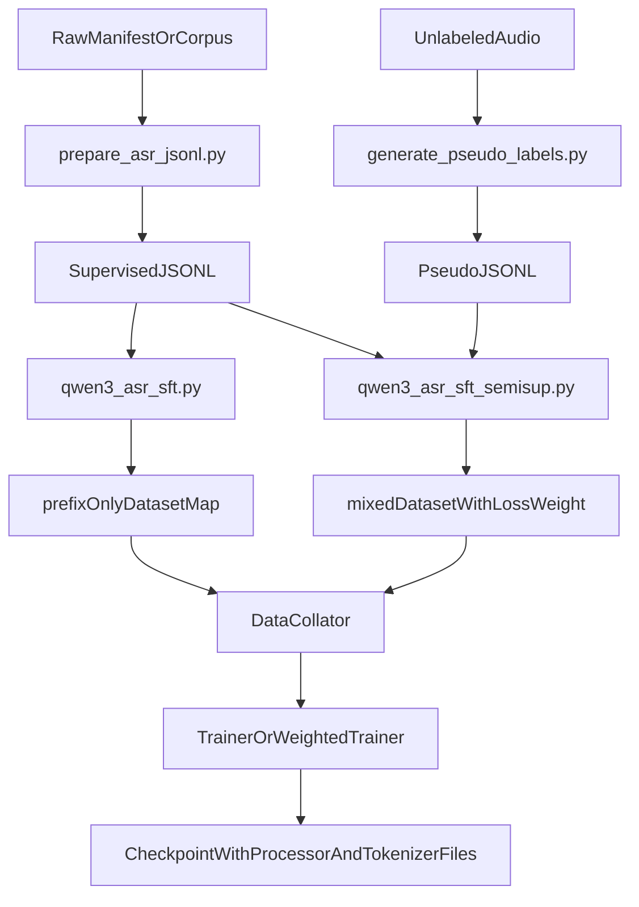
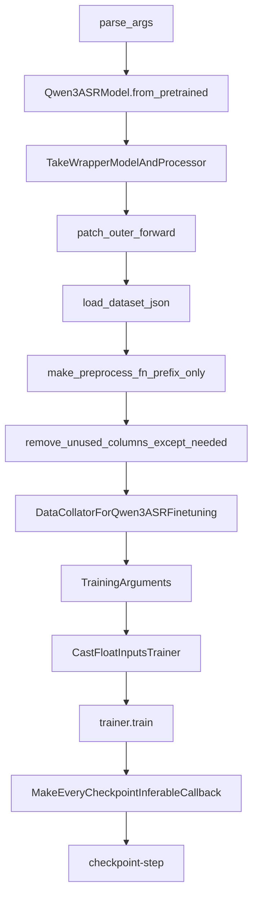

# Qwen3-ASR Finetuning 深度解读

这份报告的目标不是重复 README 的命令行说明，而是把 `finetuning` 目录背后的设计思路、数据流、调用链和训练目标讲清楚。读完后，你应该能回答下面这些问题：

- 为什么这个项目的 ASR 微调是“生成式 SFT”而不是传统 CTC 训练。
- 为什么训练标签要写成 `language Chinese<asr_text>你好` 这种形式。
- `qwen3_asr_sft.py` 为什么要先做一次 prefix-only 预处理，再在 collator 里做两次 `processor(...)`。
- 半监督脚本到底改了什么，没改什么。
- 为什么保存出来的每个 checkpoint 都可以直接拿去推理。

## 1. 一句话理解这套微调

Qwen3-ASR 把语音识别建模成一个多模态条件生成任务：

- 输入：聊天模板前缀 + 音频
- 输出：模型续写出的 ASR 结果
- 监督：只对答案后缀部分算 loss，不对 prompt 和 padding 算 loss

所以它不是“换一个 ASR 头单独训”，而是“继续教一个多模态生成模型，在看到音频和上下文后输出规范化转写结果”。

## 2. 目录里每个脚本负责什么

### `asr_data_utils.py`

公共数据工具层，只负责把训练外部世界整理干净：

- 读取 CSV / TSV / JSON / JSONL
- 解析和补全音频路径
- 规范化 prompt
- 把普通 transcript 包装成 Qwen3-ASR 训练期望的文本协议
- 切分 train / eval
- 遍历无标注音频目录

它不碰模型，也不碰 GPU。

### `prepare_asr_jsonl.py`

把人工标注数据转换成训练脚本可直接消费的 JSONL。

输入可以是：

- CSV
- TSV
- JSON
- JSONL

输出会变成统一 schema：

```json
{"audio":"/abs/path/a.wav","text":"language Chinese<asr_text>你好"}
```

如果有 prompt，还会保留：

```json
{"audio":"/abs/path/a.wav","text":"language Chinese<asr_text>你好","prompt":"你是一个语音识别助手"}
```

### `qwen3_asr_sft.py`

标准监督式 SFT 主脚本，负责：

- 加载基座模型和 processor
- 把每条样本先预处理出 `prefix_text`
- 在 collator 里读取音频并构造 batch
- 对 prefix token 和 padding token 做 label masking
- 调 Hugging Face `Trainer` 训练
- 保存可直接推理的 checkpoint

### `generate_pseudo_labels.py`

把无标注音频用现有 Qwen3-ASR 模型先跑一遍，生成伪标签 JSONL。

伪标签输出仍然会遵守和监督数据相同的训练 schema，这样后续半监督训练时就可以直接拼接数据集，而不是写一套新的数据流。

### `qwen3_asr_sft_semisup.py`

在 `qwen3_asr_sft.py` 的基础上增加一层“数据混合 + loss 加权”。

它做的事情非常克制：

- 不改模型结构
- 不改 processor 契约
- 不改 collator 的主逻辑
- 只是在样本级别引入 `loss_weight`

这意味着半监督训练是“同一套 SFT 机制 + 不同来源样本的不同权重”。

## 3. 从原始数据到 checkpoint 的全链路



## 4. 监督式 SFT 的详细调用链

下面这张图只关注 `qwen3_asr_sft.py` 本身。



对应到代码，大致可以理解成下面的阶段：

### 阶段 A：加载模型与 processor

`Qwen3ASRModel.from_pretrained(...)` 会同时加载：

- HF 模型对象
- 多模态 processor

训练脚本真正拿来训练的其实不是高层 wrapper API，而是：

- `asr_wrapper.model`
- `asr_wrapper.processor`

高层 wrapper 的 `transcribe()`、长音频切块、对齐器这些功能，在 SFT 主循环里并不会直接用到。

### 阶段 B：给 Trainer 修一层 `forward`

`patch_outer_forward(model)` 的目的是让 Hugging Face `Trainer` 能把 batch 直接喂给模型。

这里的背景是：

- 训练真正要调用的是底层 multimodal `thinker.forward`
- 但 `Trainer` 默认期望顶层 `model.forward(...)`

所以脚本做了一层代理，让 `Trainer` 不用知道 Qwen3-ASR 的内部包装结构。

### 阶段 C：把原始样本先映射成轻量中间表示

`make_preprocess_fn_prefix_only(processor)` 不会在这一步读音频，而是只生成 `prefix_text`：

- system 里放 `prompt`
- user 里放一个 audio slot
- 用 `processor.apply_chat_template(..., add_generation_prompt=True)` 渲染出文本前缀

中间结果保留：

- `audio`
- `target`
- `prefix_text`

这样做的好处是：

- 数据集 map 阶段轻量、可缓存
- 真正昂贵的音频读取留到 batch 组装时再做

### 阶段 D：collator 里做真正的多模态 batch 构造

这是整个训练逻辑的关键。

`DataCollatorForQwen3ASRFinetuning` 做了 5 件核心事情：

1. 从磁盘读取 waveform
2. 把 `prefix_text + target + eos` 拼成完整训练文本
3. 用 `processor(text=full_texts, audio=audios)` 构造完整输入
4. 再用 `processor(text=prefix_texts, audio=audios)` 构造 prefix-only 输入
5. 根据 prefix 长度把 `labels` 中前缀部分置为 `-100`

为什么要做两次 `processor(...)`？

因为训练想知道“答案是从哪一个 token 开始的”。最稳妥的方式不是去猜字符串长度，而是：

- 对同一批音频和同一模板
- 分别编码“完整序列”和“仅前缀序列”
- 用前缀编码后的 `attention_mask.sum()` 得到 prefix token 长度

这样就能准确地把 prefix 部分从监督里排除掉。

### 阶段 E：Trainer 做标准自回归语言模型训练

collator 返回的核心 batch 字段包括：

- `input_ids`
- `attention_mask`
- `input_features`
- `feature_attention_mask`
- `labels`

然后 `Trainer` 调模型时，loss 只会来自 `labels != -100` 的位置。

因此模型真正学习的是：

- 看到前缀时应该如何继续生成 ASR 结果
- 而不是去背 prompt 模板本身

## 5. 为什么训练目标不是纯文本，而是 `language X<asr_text>...`

因为这个仓库的推理协议就是这么设计的。

模型不是简单输出一个裸 transcript，而是遵守一个轻量文本协议：

- `language Chinese<asr_text>你好`
- `language English<asr_text>Hello`

这样做的好处是：

- 同一个 decoder 可以同时表达“语言信息”和“转写文本”
- 推理阶段和训练阶段使用同一套输出格式
- 伪标签生成阶段也能复用完全相同的 schema

因此 `format_asr_target()` 是整个 `finetuning` 目录里一个非常关键的函数。它保证无论你的原始标注是什么样，最终进入训练的文本都收敛到统一协议。

## 6. 为什么 prefix 不参与 loss

如果 prefix 也算 loss，会出现两个问题：

1. 模型会被迫重复学习聊天模板和结构 token，这不是我们真正关心的能力。
2. 音频占位、系统 prompt、用户消息结构本来只是条件上下文，不应该被视为“答案”。

ASR 微调真正想优化的是：

- 在这些条件已经给定的情况下
- 预测正确的 assistant-side transcript

所以 prefix 和 padding 都被设成 `-100`。

这是整个脚本最重要的监督边界。

## 7. 训练与推理共用了什么，没共用什么

### 共用的部分

- 同一个 base model checkpoint
- 同一个 processor
- 同一种聊天模板
- 同一种输出文本协议
- 同样的 16kHz 音频前处理预期

### 没共用的部分

- 推理通常走 `transcribe()` / `generate()`
- 训练走 `Trainer` + patched `forward`
- 推理更关注 chunking、merge、可选 timestamps
- 训练更关注 batch、loss、checkpoint 保存

这也是很多初学者最容易混淆的地方：  
**训练和推理不是同一条调用路径，但它们共享同一个 multimodal contract。**

## 8. 半监督脚本到底扩展了什么

`qwen3_asr_sft_semisup.py` 的设计很“保守”，核心目的是在不打乱主训练逻辑的前提下，充分利用无标注数据。

它的额外步骤只有三层：

### 第一层：生成伪标签

`generate_pseudo_labels.py` 会：

- 从 manifest 或目录中收集音频
- 调 `Qwen3ASRModel` 做教师推理
- 把结果重新写成训练 JSONL
- 给每条伪标签样本带一个默认 `loss_weight`

输出示意：

```json
{
  "audio": "/abs/path/a.wav",
  "text": "language Chinese<asr_text>你好",
  "loss_weight": 0.3,
  "pseudo": true,
  "detected_language": "Chinese",
  "raw_text": "你好"
}
```

### 第二层：混合监督数据和伪标签数据

`build_train_dataset()` 会：

- 读取监督数据
- 读取伪标签数据
- 给每类样本补齐 `loss_weight` 和 `source`
- 拼接后打乱
- 再复用和主脚本相同的 prefix-only 预处理逻辑

### 第三层：把 loss 从“等权平均”改成“按样本权重平均”

半监督脚本不会改模型，只会在 `compute_loss()` 里：

- 重新拿 `logits` 和 `labels`
- 计算 token-level cross entropy
- 按样本内部的有效 token 数做平均
- 再乘样本权重
- 最后做加权 batch 平均

这意味着：

- 人工标注样本可以默认权重 `1.0`
- 伪标签样本可以默认权重 `0.3`
- 噪声较高的数据会参与训练，但不会和人工标注拥有完全同等的话语权

## 9. 为什么每个 checkpoint 都能直接推理

很多训练脚本只保存权重，但这里作者额外做了一个回调：

- `MakeEveryCheckpointInferableCallback`

每次保存时，它会把以下文件也复制进 checkpoint：

- `config.json`
- `generation_config.json`
- `preprocessor_config.json`
- `processor_config.json`
- `tokenizer_config.json`
- `tokenizer.json`
- `special_tokens_map.json`
- `chat_template.json`
- 以及词表相关文件

这样每个 `checkpoint-*` 都不是“只有参数”，而是一个可被 `from_pretrained()` 直接加载的完整推理单元。

对于多模态模型来说，这很重要，因为：

- tokenizer
- processor
- chat template
- special token 配置

都是模型行为的一部分，不是可有可无的附件。

## 10. 常见误区

### 误区 1：这是传统 CTC 风格 ASR 微调

不是。  
这是多模态生成式 SFT，loss 是语言模型式 next-token loss。

### 误区 2：训练时用的是高层 `Qwen3ASRModel.transcribe()`

不是。  
训练只借用了 `from_pretrained()` 来拿 `model` 和 `processor`，真正训练走的是 `Trainer -> model.forward(...)`。

### 误区 3：prefix-only 预处理阶段已经把音频编码好了

不是。  
map 阶段只渲染文本模板，不读真实 waveform。真实音频加载发生在 collator。

### 误区 4：半监督训练改了模型结构

没有。  
半监督版改的是样本混合和 loss 加权，不是模型 architecture。

### 误区 5：伪标签就是“自监督学习”

不准确。  
这里更准确的说法是 teacher-generated pseudo labeling，也就是弱监督扩充。

## 11. 如果你要接自己的数据集，需要先回答什么

当你准备接自己的数据时，先检查这几个问题：

1. 你的数据是 CSV / TSV / JSON / JSONL，还是一堆音频目录？
2. 每条样本是否有明确 transcript？
3. 音频路径是绝对路径、相对 manifest，还是相对 corpus root？
4. 你是否有语言标签？
5. 你是否需要自定义 `prompt`？
6. 你要做纯监督 SFT，还是想混入伪标签做半监督？

如果这些问题都答清楚，那么接入这个 `finetuning` 流水线通常只需要做两步：

- 用 `prepare_asr_jsonl.py` 规范化成训练 JSONL
- 再用 `qwen3_asr_sft.py` 或 `qwen3_asr_sft_semisup.py` 启动训练

## 12. 最后用一句话收束

Qwen3-ASR 的微调思想可以总结为：

**把语音识别写成一个遵守固定文本协议的多模态续写任务，再用标准 Hugging Face SFT 机制去优化“答案后缀”。**

一旦你抓住这句话，`finetuning` 目录里所有脚本的角色都会变得清晰：

- 数据准备脚本负责把世界整理成统一协议
- 训练脚本负责把协议映射成可监督的 batch
- 半监督脚本负责让不同可信度的数据在同一协议下共同学习
